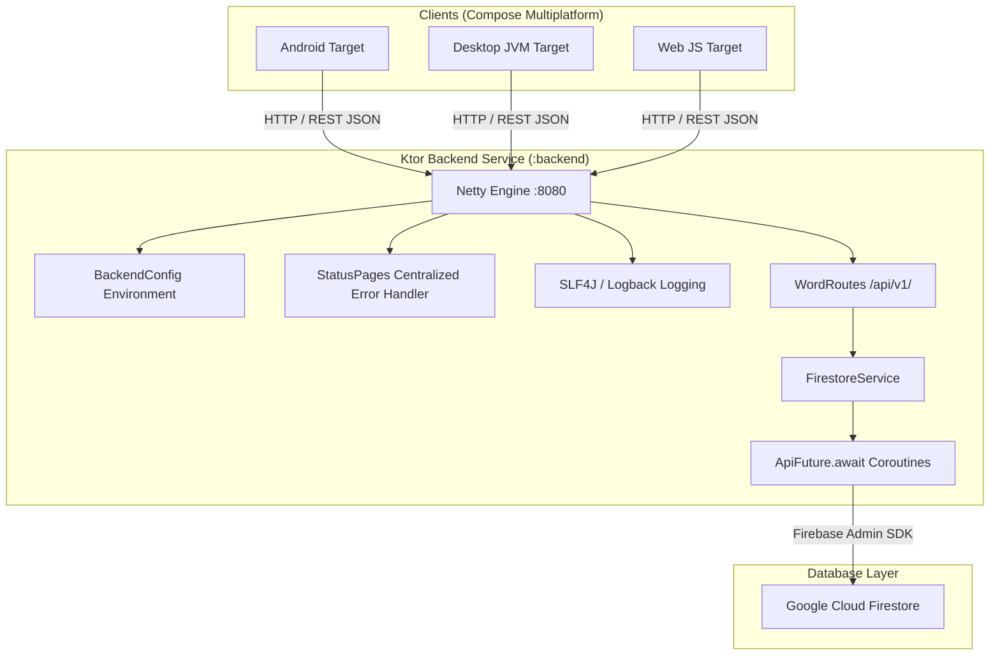

# ReMind Ktor Server Backend

This repository branch (`feature/fullstack-version`) houses the **Ktor REST Server Backend** and Full-Stack architecture for the **ReMind** Kotlin Multiplatform (KMP) German vocabulary learning application.

The backend acts as an asynchronous, non-blocking gateway between cross-platform Compose clients (Android, Desktop JVM, and Web JS) and **Cloud Firestore**, encapsulating database transactions, telemetry monitoring, and security controls. 🛠️

---

## 🏛️ System Architecture



---

## 📡 REST API Endpoint Specification (`/api/v1/`)

All API routes return standardized JSON payloads wrapped in the `ApiResponse<T>` generic DTO structure:

```json
{
  "success": true,
  "data": { ... },
  "error": null
}
```

### Endpoints Status

| Method | Endpoint | Status | Description | Response Data DTO |
| :--- | :--- | :---: | :--- | :--- |
| `GET` | `/health` | ✅ Active | Live backend telemetry, Firestore connection status & JVM memory metrics | `HealthStatusDto` |
| `GET` | `/api/v1/words` | ✅ Active | Primary endpoint returning German vocabulary items from Cloud Firestore | `List<WordDto>` |
| `GET` | `/api/v1/words/due` | ⏸️ Out of Use | Query route for SRS due filtering (disabled in v1 release) | `List<WordDto>` |
| `POST` | `/api/v1/srs/review` | 🛠️ Planned | SRS transaction update endpoint (reserved for future release) | `WordDto` |

---

## 🛠️ Backend Engineering Best Practices Implemented

### 1. Structured Logging & Monitoring
- **Server Logging**: Configured **SLF4J** with **Logback** ([`logback.xml`](file:///D:/Program%20Files%20%28x86%29/AndroidProjects/ReMind/backend/src/main/resources/logback.xml)) for timestamped console log formatting.
- **Client Logging**: Integrated **Touchlab Kermit** (`co.touchlab.kermit.Logger`) for native multiplatform logging on Android, JVM, and JS targets.
- **Telemetry Monitoring**: `/health` endpoint exposes live DB health and JVM memory telemetry:
  ```json
  {
    "status": "UP",
    "service": "ReMind Backend",
    "apiVersion": "v1",
    "databaseConnected": true,
    "freeMemoryMb": 184,
    "totalMemoryMb": 512
  }
  ```

### 2. Centralized Error Handling & Exception Management
- Installed Ktor **`StatusPages`** plugin in [`Application.kt`](file:///D:/Program%20Files%20%28x86%29/AndroidProjects/ReMind/backend/src/main/kotlin/com/ozlembasabakar/remind/backend/Application.kt).
- Intercepts all uncaught exceptions (`500`), invalid parameters (`400`), and missing routes (`404`), returning uniform `ApiResponse.error(code, message)` JSON payloads without crashing the server or exposing raw stack traces.

### 3. Type-Safe Environment Management
- Centralized configuration loader in [`BackendConfig.kt`](file:///D:/Program%20Files%20%28x86%29/AndroidProjects/ReMind/backend/src/main/kotlin/com/ozlembasabakar/remind/backend/config/BackendConfig.kt).
- Dynamically resolves `PORT` (default `8080`), `HOST` (default `0.0.0.0`), `APP_ENV` (`development`/`production`), and `GOOGLE_APPLICATION_CREDENTIALS`.
- Automatically checks `System.getProperty("user.home")` for local credential keys (`~/.credentials/remind-service-account-key.json`).
- Provided [`.env.example`](file:///D:/Program%20Files%20%28x86%29/AndroidProjects/ReMind/.env.example) template for environment setup.

### 4. Asynchronous Coroutines & Concurrency
- Runs on non-blocking Netty engine.
- Enhanced `ApiFuture<T>.await()` ([`ApiFutureUtils.kt`](file:///D:/Program%20Files%20%28x86%29/AndroidProjects/ReMind/backend/src/main/kotlin/com/ozlembasabakar/remind/backend/util/ApiFutureUtils.kt)) with coroutine cancellation (`continuation.invokeOnCancellation { cancel(true) }`).
- Enforces `withContext(Dispatchers.IO)` across all Firestore database operations.

### 5. Versioning & Security Control
- Explicit `/api/v1/` REST route scoping.
- Restricts CORS origins when `APP_ENV=production`.
- Hardened [`.gitignore`](file:///D:/Program%20Files%20%28x86%29/AndroidProjects/ReMind/.gitignore) preventing service account keys and environment secrets from leaking to Git.
- Documented project workflow in [`GIT_WORKFLOW.md`](file:///D:/Program%20Files%20%28x86%29/AndroidProjects/ReMind/GIT_WORKFLOW.md).

---

## 🚀 How to Run the Backend

### Start Server Locally
```powershell
./gradlew :backend:run
```
The server will start listening at `http://127.0.0.1:8080`.

### Physical Android Device Setup
When testing with a physical Android device over USB/Wi-Fi:
```powershell
adb reverse tcp:8080 tcp:8080
```
---

## 👔 Senior Tech Lead Evaluation: Fullstack Architecture & Engineering Excellence

> [!NOTE]
> **Fullstack Architecture & Backend Engineering Assessment**
>
> Transitioning ReMind from a client-only frontend to an enterprise-grade **Fullstack KMP + Ktor Architecture** represents a major architectural milestone. This evaluation highlights the fullstack engineering choices, non-blocking coroutine design, and security isolation implemented across the `:backend` and `:shared` modules.

### Fullstack Engineering Accomplishments
- **Decoupled Gateway Layer:** Isolated client applications from direct database credentials. The Ktor Netty backend serves as the single source of truth for Cloud Firestore access, enforcing API contract encapsulation through `ApiResponse<T>` wrappers.
- **Resilient Multi-Target Client Networking:** Engineered `RemindApiClient` in `:shared` with automated candidate IP failover (`getBaseUrl()`, `127.0.0.1:8080`, `10.0.2.2:8080`, `localhost:8080`) and connection timeouts, enabling instant connectivity across Android Emulators, physical USB/Wi-Fi devices via `adb reverse`, JVM Desktop, and Web/JS browsers.
- **Industrial Error & Concurrency Protection:** Implemented Ktor `StatusPages` for global exception safety, Touchlab Kermit for multiplatform client logging, `ApiFuture.await()` coroutine cancellation, and dynamic `/health` telemetry monitoring.
- **Security-First Environment Scoping:** Eliminated hardcoded secret paths in favor of `BackendConfig.kt`, dynamic `user.home` key resolution, and hardened `.gitignore` rules.

---

## 📂 Backend Project Structure

```text
backend/
├── src/main/kotlin/com/ozlembasabakar/remind/backend/
│   ├── Application.kt                # Ktor entrypoint, CORS, StatusPages & routes
│   ├── config/
│   │   └── BackendConfig.kt          # Environment configuration loader
│   ├── firebase/
│   │   └── FirebaseAdmin.kt          # Firebase Admin SDK initializer
│   ├── routes/
│   │   └── WordRoutes.kt             # REST endpoints (/words, /health)
│   ├── service/
│   │   └── FirestoreService.kt       # Firestore CRUD logic
│   └── util/
│       └── ApiFutureUtils.kt         # ApiFuture.await() coroutine extension
└── src/main/resources/
    └── logback.xml                   # Console logger configuration
```
