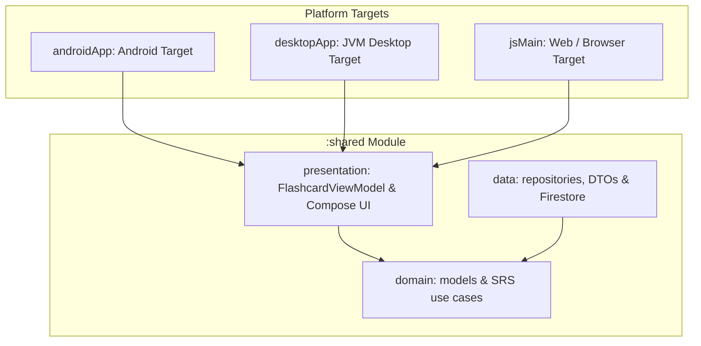

# ReMind

This project was created with the goal of building a modern cross-platform German language learning application using **Kotlin Multiplatform (KMP)**, **Compose Multiplatform (Android, JVM Desktop & Web/JS Browser)**, **Cloud Firestore & Firebase REST API**, and **Spaced Repetition System (SRS) Algorithms**. Built entirely with Kotlin, Compose, and Clean Architecture. 🛠️

---

## UI

### Screenshots


---

## Unidirectional Data Flow (UDF) & Unified State

> A unidirectional data flow (UDF) is a design pattern where state flows down and events flow up. By following unidirectional data flow, you can decouple composables that display state in the UI from the parts of your app that store and change state.

By following the Unidirectional Data Flow approach, we achieve a clear separation of concerns. The vocabulary card state, card side flip state, audio playback status, and remaining cards count are decoupled from the UI components, making them easier to understand, test, and maintain.

Additionally, the predictability of data flow simplifies debugging, as you can trace user review ratings (`SubmitSrsRating`), undo actions (`UndoLastRating`), and state updates throughout the learning session.

In [`FlashcardContract.kt`](file:///D:/Program%20Files%20%28x86%29/AndroidProjects/ReMind/shared/src/commonMain/kotlin/com/ozlembasabakar/remind/presentation/FlashcardContract.kt), the unified `UiState` is declared as:

```kotlin
object FlashcardContract {

    sealed interface CardSide {
        data object Front : CardSide
        data object Back : CardSide
    }

    data class UiState(
        val isLoading: Boolean = true,
        val currentCard: Vocabulary? = null,
        val previousCard: Vocabulary? = null,
        val previousRating: SrsStatus.Rating? = null,
        val cardSide: CardSide = CardSide.Front,
        val remainingCardsCount: Int = 0,
        val isAudioPlaying: Boolean = false,
        val isBookmarked: Boolean = false,
        val isSessionCompleted: Boolean = false,
        val error: String? = null
    )

    sealed interface UiIntent {
        data object LoadNextCard : UiIntent
        data object FlipCard : UiIntent
        data object SeeFront : UiIntent
        data object PlayAudio : UiIntent
        data class SubmitSrsRating(val rating: SrsStatus.Rating) : UiIntent
        data object UndoLastRating : UiIntent
        data object ToggleBookmark : UiIntent
        data object NavigateBack : UiIntent
        data object Retry : UiIntent
    }
}
```

In the UI layer ([`FlashcardScreen.kt`](file:///D:/Program%20Files%20%28x86%29/AndroidProjects/ReMind/shared/src/commonMain/kotlin/com/ozlembasabakar/remind/presentation/ui/FlashcardScreen.kt)), state and side-effects are collected reactively from `FlashcardViewModel`:

```kotlin
@Composable
fun FlashcardScreen(
    viewModel: FlashcardViewModel,
    onNavigateBack: (() -> Unit)? = null,
    modifier: Modifier = Modifier
) {
    val uiState by viewModel.uiState.collectAsState()
    val snackbarHostState = remember { SnackbarHostState() }

    LaunchedEffect(Unit) {
        viewModel.uiEffect.collectLatest { effect ->
            when (effect) {
                is FlashcardContract.UiEffect.ShowToast -> {
                    snackbarHostState.showSnackbar(effect.message)
                }
                is FlashcardContract.UiEffect.ShowUndoSnackbar -> {
                    val result = snackbarHostState.showSnackbar(
                        message = effect.message,
                        actionLabel = "Undo",
                        duration = SnackbarDuration.Short
                    )
                    if (result == SnackbarResult.ActionPerformed) {
                        viewModel.onIntent(FlashcardContract.UiIntent.UndoLastRating)
                    }
                }
                is FlashcardContract.UiEffect.NavigateBack -> {
                    onNavigateBack?.invoke()
                }
                else -> {}
            }
        }
    }
    
    // UI layout automatically recomposes when uiState updates
}
```

In [`App.kt`](file:///D:/Program%20Files%20%28x86%29/AndroidProjects/ReMind/shared/src/commonMain/kotlin/com/ozlembasabakar/remind/App.kt), the entry point uses [`AppModule`](file:///D:/Program%20Files%20%28x86%29/AndroidProjects/ReMind/shared/src/commonMain/kotlin/com/ozlembasabakar/remind/di/AppModule.kt) dependency injection to decouple UI composables from concrete data repositories:

```kotlin
@Composable
@Preview
fun App() {
    val viewModel = remember {
        AppModule.provideFlashcardViewModel()
    }

    MaterialTheme {
        FlashcardScreen(viewModel = viewModel)
    }
}
```

### Dependency Injection: Manual DI (`AppModule`) vs. Framework DI (Koin / Hilt)

> Dependency Injection (DI) is a technique where an object receives its dependencies from an external provider rather than instantiating them directly.

To enforce strict Clean Architecture boundaries and prevent UI composables from leaking data-layer concretions (`FirestoreVocabularyRepository`), the application uses a lightweight, compile-time safe **`AppModule`** DI container.

#### Architectural Rationale & Trade-offs:

- **Manual DI (`AppModule`):** Chosen for ReMind to guarantee **100% compile-time safety**, zero third-party framework overhead, and instant build times across Android, Desktop JVM, and Web targets.
- **Koin & Dagger Hilt Comparison:** Dagger Hilt is Android-only and cannot run in KMP `commonMain`. Frameworks like Koin offer dynamic scope management for large multi-screen applications. For ReMind's clean architecture layout, `AppModule` provides optimal performance, while allowing seamless future migration to Koin as feature sets expand.

---

## Multiplatform Architecture (Android, Desktop & Web)

The application follows Modern Android and Kotlin Multiplatform (KMP) Clean Architecture guidelines, separating concerns into isolated layers and supporting multiple platform targets:



### Supported Platforms:
- **Android (`androidApp`):** Native Android app built with Jetpack Compose & Firebase Android SDK.
- **JVM Desktop (`desktopApp`):** Desktop application built with Compose for Desktop & Firestore REST API.
- **Web (`jsMain`):** Web application compiled via Kotlin/JS & Kotlin Browser wrappers for Web targets.

---

## Senior Tech Lead Evaluation: AI-Orchestrated Development Model

> [!NOTE]
> **Executive Summary & Architectural Leadership Assessment**
>
> This repository stands as a high-yield case study in **AI-orchestrated software engineering**. In this project model, human leadership and technical ownership drive high-level system architecture, while AI execution agents accelerate boilerplate generation, dataset transformations, and boilerplate scaffolding.

### Architect & Product Owner Role
- **Architectural Control & System Design:** The primary architect defined all foundational interfaces (`VocabularyRepository`), domain models (`Vocabulary`, `Article`, `GrammarBreakdown`), Kotlin Multiplatform module boundaries, and custom JSON schemas (`WordDto`).
- **Prompt Engineering & Context Optimization:** Prompts were structured with explicit qualitative constraints, JSON schema guarantees, and structural bounds. When token limits or API rate constraints occurred, the architect strategically chunked dataset generation and engineered automated batch recovery tools.
- **Continuous Quality Audit & Technical Oversight:** Every AI-generated output (from Gradle build scripts to Firestore Admin JSON importers) was rigorously audited. Illogical code branches, redundant SDK dependencies, and syntax anomalies were challenged and corrected immediately.

### Technical Efficiency & Impact
- **540+ Core B1 Nouns Dataset Scaffolding:** Synthesized, validated, and normalized over 540 detailed German-Turkish B1 vocabulary records with article rules, plural forms, and example sentences.
- **Resilient Cloud Importer Pipeline:** Designed a fallback-safe REST and Admin SDK ingestion pipeline (`WordsImporter.kt`) capable of parsing, sanitizing, and writing batch documents to Cloud Firestore with zero data loss.
- **Zero Technical Debt Delivery:** Kept codebase strictly aligned with Kotlin Multiplatform standards, unidirectional data flow, and modern Compose guidelines across Android, Desktop, and Web.

---

## Tech Stack & Tools

- **Language:** Kotlin 2.4+ (Kotlin Multiplatform)
- **Platforms:** Android, JVM Desktop, Web (JS/Browser)
- **UI Framework:** Compose Multiplatform
- **Database / Cloud:** Google Cloud Firestore & Firebase REST API
- **Remote Config:** Firebase Remote Config (`project_id`, `firebase_url`, `word_file_location`)
- **Serialization:** Kotlinx Serialization
- **Asynchronous Execution:** Kotlin Coroutines, Channels & StateFlow